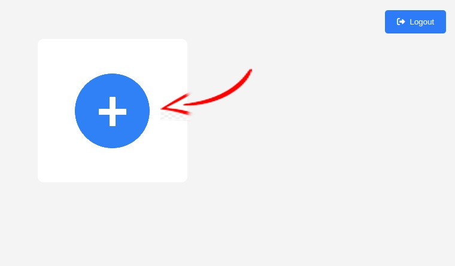
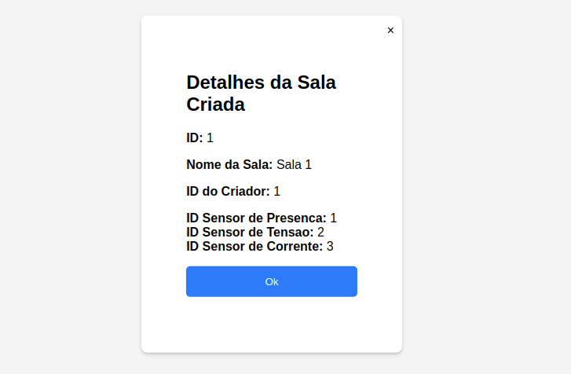
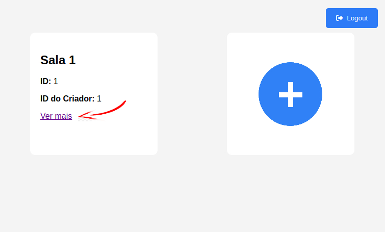
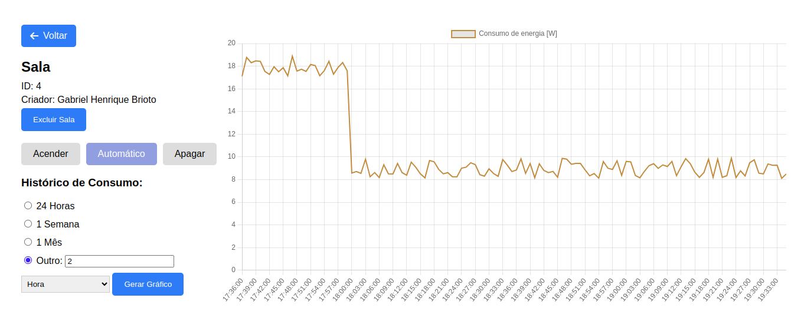
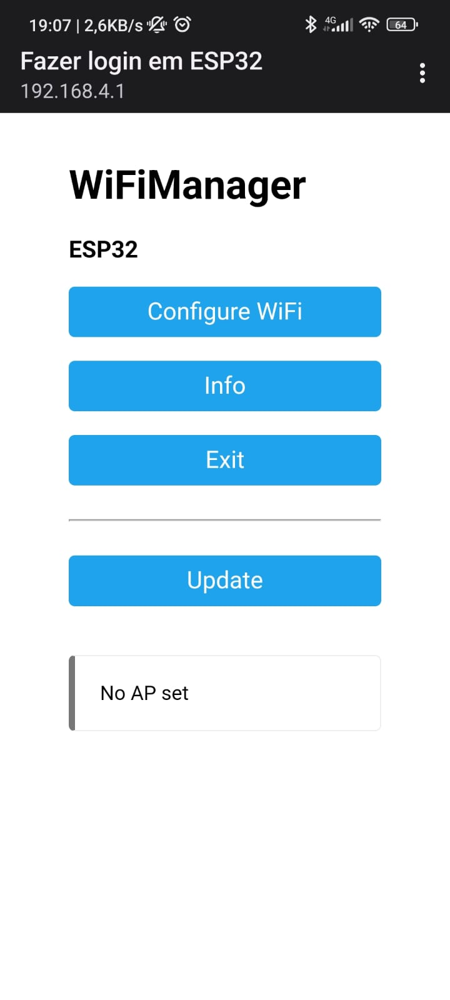
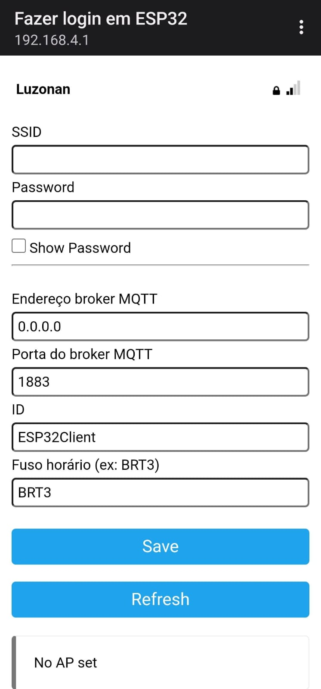

# 💡 Sistema de Monitoramento e Controle de Iluminação Inteligente

Este projeto implementa um sistema IoT para monitorar e controlar a iluminação em ambientes internos, como escritórios, residências ou salas de aula, utilizando sensores e microcontroladores. A solução visa eficiência energética, conforto dos usuários e facilidade de controle via interface web.

---

## 🛠️ Funcionalidades

- **Monitoramento de presença** com sensores PIR.
- **Controle automático de iluminação** baseado na detecção de movimento.
- **Relatórios de consumo energético** gerados em tempo real.
- **Interface web** para visualização e controle manual.
- **Armazenamento de dados** em banco relacional com histórico de consumo.
- **Conexão segura e escalável** usando protocolo MQTT.

---

## 📦 Estrutura do Projeto

O projeto está organizado da seguinte maneira:

```plaintext
.
├── BackEnd           # Backend desenvolvido com Spring Boot WebFlux
├── DataBase          # Scripts e configuração do banco de dados PostgreSQL
├── Esp32             # Firmware para o microcontrolador ESP32
├── Mosquitto-MQTT    # Configuração do broker MQTT Mosquitto
├── WebApp            # Interface web desenvolvida com HTML, CSS e JavaScript
├── docker-compose.yml # Configuração para Docker Compose
└── docker.conf       # Arquivo de configuração do broker Docker
```

---

## 🚀 Tecnologias Utilizadas

- **Frontend**: HTML, CSS, JavaScript
- **Backend**: Spring Boot (WebFlux), Reactive Programming
- **Banco de Dados**: PostgreSQL (R2DBC para comunicação reativa)
- **Hardware**: ESP32, sensores de presença, sensores de corrente/tensão
- **Comunicação**: Protocolo MQTT com broker Mosquitto
- **Docker**: Contêineres para gerenciamento do ambiente

---

## ⚙️ Pré-requisitos

Certifique-se de ter instalado:

- **Docker** e **Docker Compose**
- **Java 17+** e **Maven**
- **Node.js** para testes no frontend
- **Placa ESP32** com suporte para conexão Wi-Fi
- **PostgreSQL** para o banco de dados

---

## 🚧 Como Executar

### 1. Clone o Repositório
```bash
git clone https://github.com/gabrielhbrioto/IoT.git iot
cd iot
```

### 3. Inicie os Contêineres Docker

Por padrão, a aplicação web é mapeada para a porta 8081, onde pode ser acessada por usuários de fora do Contâiner. Caso o usuário deseje alterar a porta na qual a aplicação deve ficar disponível, basta alterar a seguinte linha do arquivo `docker.conf`:

```bash
WEBAPP_PORTS=8081:8081
```

Para expor a aplicação na porta 80, por exemplo, ficaria:

```bash
WEBAPP_PORTS=80:8081
```

O procedimento é o mesmo para alterar a porta do broker MQTT.

Em seguida, exporte automaticamente as variáveis definidas no arquivo `docker.conf` para o ambiente atual, tornando-as disponíveis para uso subsequente do `docker compose`.

```bash
set -a && source docker.conf
```

Costrua os contâineres com o `docker compose`:

```bash
docker compose up --build
```

### 4. Acesse a Página Web

 Abra o navegador e acesse a interface web na porta configurada no `docker-compose`. Em seguida, cadastre-se e faça login. 

 <div align="center">
 
 </div>

 Na página principal haverá um card com a imagem de um símbolo de adição através do qual há a possibilidade de criar uma nova sala ou se inscrever para receber atualizações de uma sala já existente. Basta selecionar uma das opções e preencher o campo abaixo. Caso se deseje realizar a inscrição em uma sala, será requisitado o ID da sala em questão. Já para a criação de uma sala, que é nosso foco aqui, é solicitado um nome para a sala a ser criada.

 <div align="center">
 
 </div>

 <div align="center">
 
 </div>

 Após a criação da sala são exibidos os IDs dos sensores a serem utilizados na sala e o ID da sala, que deve ser utilizado para a configuração da ESP32, como será visto no tópico seguinte.

 <div align="center">
 
 </div>

 Depois de criada, a sala passa a ser listada na tela principal da aplicação. Basta clicar em "ver mais" para acessar uma página dedicada àquela sala.

 <div align="center">
 
 </div>

 Nesta nova página estão listadas algumas das principais informações referentes àquela sala, bem como uma interface de controle da iluminação que permite alternar entre os estados `aceso`, no qual as luzes permanecem acesas independentemente da presença ou não de pessoas no local; `apagado`, no qual as luzes permanecem apagadas independentemente da presença de possoas no local; e `automático`, onde o acendimento das luzes está condicionado à presença de indivíduos dentro da sala. 
 
 É também nessa página que o usuário pode consultar o histórico de consumo de energia pelo sistema de iluminação, gerando um gráfico de consumo com base em um período de tempo escolhido. Por fim, é nessa sala que o criador da sala tem a opção de excluir a sala do sistema.

 <div align="center">
 
 </div>

### 5. Firmware do ESP32

Compile e envie o firmware localizado na pasta `Esp32` para o microcontrolador ESP32.

 Depois disso, com a ESP em funcionamento, acesse o seu IP. Isso deve fazer com que a seguinte página do `WiFiManager` apareça:

 <div align="center">
 
 </div>

 Clique em "Configure WiFi" e prossiga para a tela de configuração. Nela aparecerão campos para serem preenchidos com informações da rede Wi-fi na qual se deseja conectar a ESP32, sendo elas o nome da rede e a senha para conexão. Também será necessário informar o IP e porta do broker MQTT, além do ID para conexão - que deve ser o ID da sala - e o fuso horário local.

 Todos estes dados configurados pelo WiFiManager são salvos no armazenamento não volátil (NVS) da ESP32. Este é um espaço de memória integrado no microcontrolador usado para armazenar informações que precisam ser mantidas mesmo após um reinício ou desligamento do dispositivo.

 <div align="center">
 
 </div>

 Caso o firmware já tenha sido carregado anteriormente e a ESP32 tenha sido configurada, mas seja do interesse do usuário alterar suas configurações, basta apertar o botão da ESP32 até que a luz azul contida na placa da própria ESP comece a piscar, indicando que ela foi reiniciada e os dados apagados. Assim, ela pode ser configurada novamente.

### 6 Pausando e iniciando os contâineres

Caso seja necessário pausar os contâineres em algum momento, isto é feito por meio do comando:

```bash
docker compose stop
```

E para acionar novamente esses contâineres utiliza-se:

```bash
docker compose start
```

Para listar o status dos contâineres:

```bash
docker compose ps
```

### 7 Removendo os Contâineres

Caso deseje encerrar os contâineres criados anteriormente, basta utilizar o comando:

```bash
docker compose down
```

Utilizando a flag `--rmi` também remove imagens criadas localmente para os serviços e a flag `--volumes` remove os volumes associados aos serviços.

⚠️ Cuidado: Isso pode apagar dados permanentes armazenados nesses volumes.

## 🔍 Detalhes Técnicos

### Backend 🌐
- Desenvolvido em **Spring Boot WebFlux** para comunicação reativa e escalável.
- Integração com o broker MQTT e o banco de dados para monitoramento e controle.

### Firmware para ESP32 💻
- Detecta movimento utilizando sensores de presença.
- Monitora consumo energético com sensores de corrente e tensão.
- Comunica-se com o servidor via protocolo MQTT.

### Frontend 🎨
- Interface simples e responsiva, permitindo controle manual e visualização de consumo.

### MQTT 🚀
- Configuração do broker com Mosquitto para troca de mensagens entre dispositivos.

---

## 🧪 Testes

- **Desempenho**: Avaliado sob carga para garantir responsividade.
- **Latência**: Testes de detecção e ajuste de iluminação em tempo real.
- **Funcionalidade**: Verificação completa de todas as interações do sistema.
- **Usabilidade**: Interface intuitiva e acessível para usuários finais.

---

## 🔧 Melhorias Futuras

- Edição de informações das salas diretamente pela interface.
- Integração com assistentes virtuais, como Alexa ou Google Assistant.
- Suporte a múltiplas zonas com diferentes configurações.
- Otimização para dispositivos de baixa potência.

---

## 📄 Licença

Este projeto está licenciado sob os termos da **MIT License**. Veja o arquivo `LICENSE.md` para mais informações.

